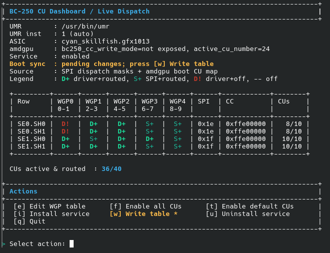
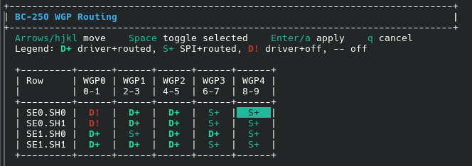

# BC-250 CU Live Manager

Live CU and WGP dispatch manager for AMD BC-250 (`gfx1013`) using UMR.

This project is centered around an interactive terminal UI, with CLI commands
available for automation.

## Interactive UI (Recommended)

Download the latest script:

```bash
curl -L -o bc250-cu-live-manager.sh https://raw.githubusercontent.com/WinnieLV/bc250-cu-live-manager/refs/heads/main/bc250-cu-live-manager.sh && chmod +x bc250-cu-live-manager.sh
```
Launch the UI:

```bash
sudo ./bc250-cu-live-manager.sh
```

`menu` is the default command, so running the script directly opens the UI.

Main dashboard and action menu:



WGP table editor:



### UI Workflow

1. Open the UI with `sudo ./bc250-cu-live-manager.sh`.
2. If UMR is missing, the UI asks once whether you want to install it now.
3. Press `e` to edit the WGP routing table.
4. Use arrow keys or `h/j/k/l` to move.
5. Press `Space` to toggle an unlocked WGP.
6. Press `Enter` or `a` to apply.
7. Back in the menu, press `w` to save the current table.
8. Press `i` to install and enable the boot service.

### Editor Controls

- Move: arrow keys or `h/j/k/l`
- Toggle: `Space`
- Apply: `Enter` or `a`
- Cancel: `q`

### Menu Actions

- `e`: edit WGP table
- `f`: full dispatch preset
- `t`: restore driver dispatch
- `w`: write current table to boot config
- `i`: install boot service
- `u`: uninstall boot service
- `q`: quit

When UMR is not detected, the dashboard warns and the UI asks once if you want
to install it immediately.

### `Write table` Button Behavior

`[w] Write table` is always visible in the Actions menu.

It is shown as `[w] Write table *` (with a star) when boot table sync is
pending. Pending means either:

- The service is installed but no saved table exists yet.
- A saved table exists, but it does not match the current live table.

When the live table matches the saved boot table, the star is not shown.

## What This Script Does

- Reads and writes BC-250 dispatch-related registers live:
  - `mmCC_GC_SHADER_ARRAY_CONFIG`
  - `mmSPI_PG_ENABLE_STATIC_WGP_MASK`
  - `mmRLC_PG_ALWAYS_ON_WGP_MASK`
- Works at WGP granularity (1 WGP = 2 CUs).
- Applies masks per row: `SE0.SH0`, `SE0.SH1`, `SE1.SH0`, `SE1.SH1`.
- Saves a boot profile and can replay it at boot via systemd.

Pinned default naming:

- ASIC selector: `cyan_skillfish.gfx1013`
- Register naming: `mm*`

## Do You Need a Kernel Patch?

No for this workflow.

This script performs live register writes directly through UMR. Kernel patch
material remains useful as reference and alternate approach, but it is not
required to use this tool.

## Boot Config File

The saved boot profile is stored at:

- `/etc/bc250-cu-live-manager.conf`

This file is created or updated by:

```bash
sudo ./bc250-cu-live-manager.sh write-service-table
```

The key value used by the script is:

- `BC250_WGP_MASKS=SE0.SH0,SE0.SH1,SE1.SH0,SE1.SH1`
- `UMR_ASIC=<umr asic selector>`
- `UMR_INSTANCE=<umr dri instance>`
- `UMR=<path to umr binary>`

Example:

```ini
BC250_WGP_MASKS=0x1f,0x1f,0x1f,0x1f
UMR_ASIC=cyan_skillfish.gfx1013
UMR_INSTANCE=1
UMR=/usr/bin/umr
```

How it is used:

- `apply-service` reads this file and applies the saved masks immediately.
- `install-service` configures a systemd oneshot service that applies this
  saved table on boot.
- The systemd unit loads this same file as `EnvironmentFile`, so `UMR`,
  `UMR_INSTANCE`, and `UMR_ASIC` overrides persist across reboot.

## Requirements

### Hardware

- AMD BC-250 (PCI ID `13fe`)

### Software

- `bash`
- `umr`
- `python3` (driver topology readout)
- `libdrm_amdgpu.so.1` (provided by libdrm packages)
- `systemd` (only needed for boot service workflow)
- root privileges for register access

## OS Setup

`install-umr` supports:

- `pacman` / `paru` (Arch, CachyOS)
- `dnf` (Fedora)
- `rpm-ostree` (Bazzite and other immutable Fedora systems)

### Arch / CachyOS / Fedora

```bash
sudo ./bc250-cu-live-manager.sh install-umr
sudo ./bc250-cu-live-manager.sh
```

### Bazzite / rpm-ostree

```bash
# Layer umr onto the host image
sudo ./bc250-cu-live-manager.sh install-umr

# Required after layering
sudo reboot

# Start UI after reboot
sudo ./bc250-cu-live-manager.sh
```

Notes for immutable systems:

- `rpm-ostree install` is host-level and reboot-based.
- Service binary install falls back to `/var/usrlocal/bin` when `/usr/local/bin`
  is not writable.

## CLI Commands (Optional)

You can still use direct commands when scripting:

```bash
# Status dashboard
sudo ./bc250-cu-live-manager.sh status

# Full on/off
sudo ./bc250-cu-live-manager.sh enable all
sudo ./bc250-cu-live-manager.sh disable all

# Restore driver topology dispatch
sudo ./bc250-cu-live-manager.sh stock-dispatch

# WGP and CU targeting
sudo ./bc250-cu-live-manager.sh enable-wgp 1.0.4
sudo ./bc250-cu-live-manager.sh disable-wgp 1.0.4
sudo ./bc250-cu-live-manager.sh enable-cu 1.0.8
sudo ./bc250-cu-live-manager.sh disable-cu 1.0.8

# Boot profile and service
sudo ./bc250-cu-live-manager.sh write-service-table
sudo ./bc250-cu-live-manager.sh install-service
sudo ./bc250-cu-live-manager.sh apply-service
sudo ./bc250-cu-live-manager.sh uninstall-service
```

Useful flags:

```bash
# Non-interactive mode
sudo ./bc250-cu-live-manager.sh --yes enable all

# Print writes only
sudo ./bc250-cu-live-manager.sh --dry-run enable all

# Override BC-250 PCI detection guard
sudo ./bc250-cu-live-manager.sh --force enable all

# Force umr to use a specific DRI instance
sudo ./bc250-cu-live-manager.sh --umr-instance 1 status
```

## Safety Behavior

- The script prompts a safety disclaimer before write actions.
- Type `accept` to continue, or use `--yes` for non-interactive runs.
- Live disable paths are blocked when driver-active WGPs would be disabled.


## Sources

- Kernel patch and research base:
  https://github.com/duggasco/bc250-40cu-unlock
- Live unlock test demo script:
  https://github.com/gennro/bc250-toolkit/blob/main/CachyOS-BC250-CU-Unlock.sh
